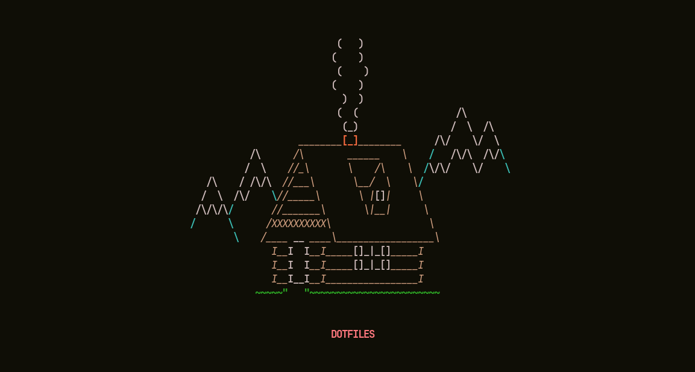
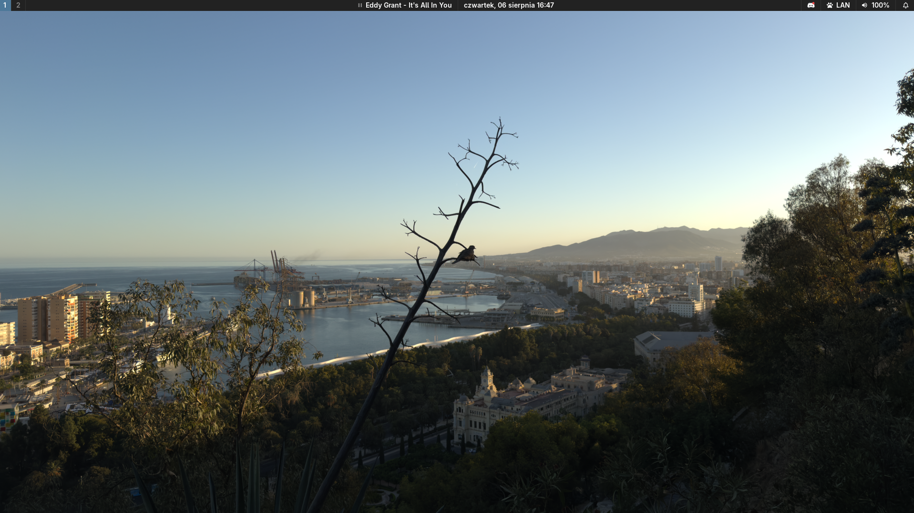

<div align="center">



<br/>

_My very personal configuration of my very personal dotfiles_

> Yeah, that image is a screenshot of my Neovim dashboard.

</div>

## 📂 Managed with GNU Stow

These dotfiles are managed using **GNU Stow**, which automatically creates symbolic links from your home directory pointing to the repository.
Sick tool, I recommend using it very much.

### Applying Configurations
To install or refresh the symbolic links in your home directory, run the following command from the root of the repository:
```bash
stow -v -R -t ~ nvim emacs ghostty zathura tmux
```

### Removing Configurations
To safely remove the symbolic links, run:
```bash
stow -v -D -t ~ nvim emacs ghostty zathura tmux
```

## 📸 Screenshots

Since I'm using `sway` most of the time I don't even see my wallpaper. Very often I see just my terminal (shoutout [`ghostty`](https://ghostty.org/)!)

I've used multiple configurations, some of them are listed down below. \
Current one is at the very top of the very bottom of that README:

### Fedora

#### Sway (Current)



#### Hyprland


#### GNOME


### Arch Linux

